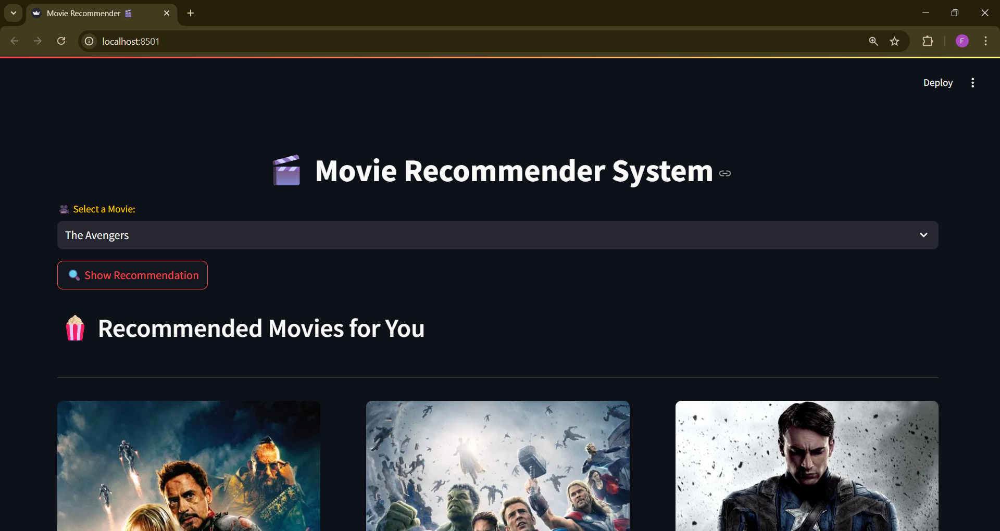
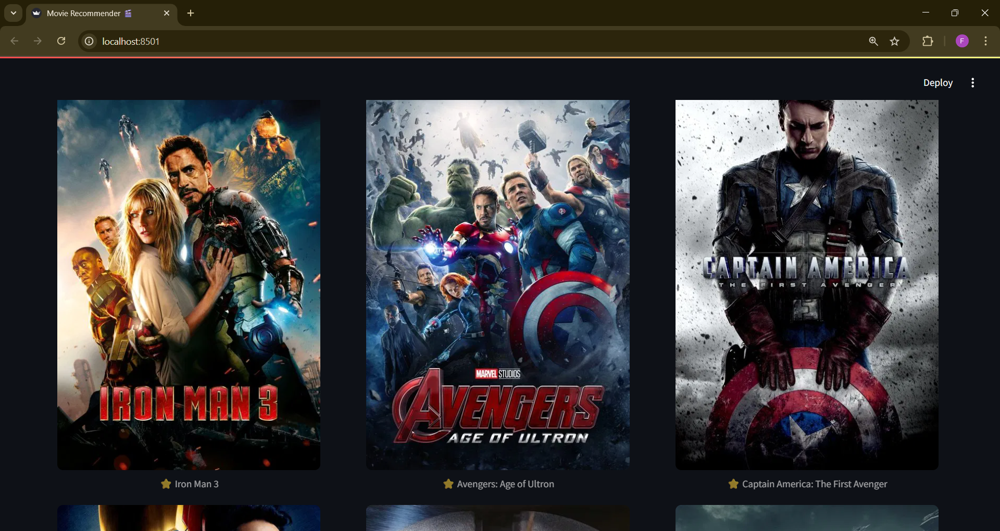

# Movie Recommendation System

A simple and intelligent **Streamlit-based application** that recommends movies similar to the one you like.  
It uses a **Content-Based Filtering approach** trained on the TMDB 5000 Movie Dataset and fetches **real-time movie posters** using the TMDB API.

---

## ✨ Features

* Get **top movie recommendations** instantly
* Powered by **Content-Based Similarity (Cosine Similarity over Bag-of-Words/TF-IDF features)**
* Fetches **high-quality movie posters** from TMDB API
* Interactive **Streamlit UI**
* Lightweight and fast — runs locally with `.pkl` files

---

## ⚙️ Installation & Setup

```bash
# 1. Clone the repository
git clone https://github.com/02priyeshraj/Movie_Recommender_Streamlit_app.git
cd Movie-Recommendation-System

# 2. Create and activate a virtual environment
python -m venv venv
# Windows:
venv\Scripts\activate
# Linux/macOS:
source venv/bin/activate

# 3. Install required dependencies
pip install -r requirements.txt

# 4. Run the app
streamlit run app.py
```

---

## 📂 Project Structure

```
Recommendations_System/
│
├── app.py                     # Streamlit application (UI + poster fetch + recommendation logic)
├── Recommenders_Model.ipynb   # Jupyter Notebook for training & generating similarity matrix
├── movie_list.pkl             # Pickle file storing movie metadata
├── similarity.pkl             # Pickle file storing similarity matrix
├── requirements.txt           # All Python dependencies
├── .gitignore
├── LICENSE.txt
└── .env                       # API keys (e.g., TMDB API key)
```

---

## 🧠 How It Works

1. **Model Training (Notebook)**  
   - Dataset: TMDB 5000 Movies + Credits  
   - Extracts key features: *title, overview, genres, keywords, cast, crew*  
   - Converts them into a combined text representation  
   - Vectorizes text using **CountVectorizer**  
   - Calculates **Cosine Similarity** between movies  
   - Saves results into `movie_list.pkl` & `similarity.pkl`

2. **Streamlit Application (`app.py`)**  
   - Loads pre-trained `.pkl` files  
   - Lets users select a movie  
   - Recommends top similar movies  
   - Fetches & displays posters from **TMDB API**  
   - Skips movies with missing posters

---

## 🖼️ Screenshots

*(You can add screenshots after running the app)*  

  
  

---

## 🔑 API Key Setup

This project uses **TMDB API** for fetching posters.  
Create a `.env` file in the root directory:

```
TMDB_API_KEY=your_api_key_here
```

---

## 📝 License

MIT © [Priyesh Raj](https://github.com/02priyeshraj)
